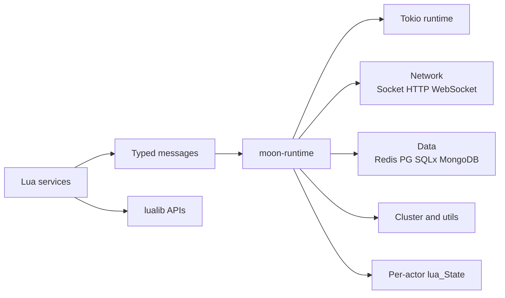

# moon_rs

`moon_rs` is a Rust reimplementation of [Moon](https://github.com/sniper00/moon): a lightweight, high-performance game server framework built around a **Lua actor runtime on Tokio**.

It keeps the original Moon model simple and scriptable, while moving scheduling, async I/O, memory control, and native integrations into Rust.

## Why It Stands Out

- **Lua-first actor model**: services communicate by typed message passing, keeping gameplay and service logic easy to script.
- **Tokio-powered runtime**: Rust handles networking, timers, HTTP, database I/O, and concurrency under the hood.
- **Per-actor isolation**: each actor owns its own `lua_State`, with support for regular actors and dedicated unique actors.
- **Practical native modules**: HTTP client/server, WebSocket, Redis, PostgreSQL, SQLx, MongoDB, cluster, filesystem, JSON, buffer, random, and more.
- **Feature-gated build**: optional modules can be compiled in or out through Cargo features.

## Architecture At A Glance



## Core Capabilities

| Area | What you get |
| --- | --- |
| Runtime | Lua actors, typed messages, timers, logger, custom per-actor memory accounting |
| Concurrency | Tokio multi-thread runtime plus dedicated execution for unique actors |
| Network | TCP sockets, framing helpers, HTTP client, HTTP server, WebSocket |
| Data | Redis, PostgreSQL protocol support, SQLx integration, MongoDB |
| Distributed | Cluster module for node-to-node communication |
| Utility | JSON, buffer, serialization, filesystem, random, sharetable, Excel/CSV helpers |

## Workspace Layout

| Path | Responsibility |
| --- | --- |
| `crates/moon-app` | binary entry point, bootstrap, signal handling |
| `crates/moon-runtime` | actor runtime (context, messages, timer, logger) + all Rust→Lua native bindings |
| `crates/moon-base` | foundation: embedded Lua 5.5 sources, Rust FFI, helper macros, shared Buffer |
| `lualib/` | user-facing Lua APIs and wrappers |
| `assets/` | examples, benchmarks, integration-style test scripts |
| `docs/` | module-focused documentation |

## Quick Start

`moon_rs` currently targets Rust nightly.

```bash
cargo build --release
cargo run --release -- assets/example/example.lua
```

Useful entry points:

```bash
# Example
cargo run --release -- assets/example/example_httpd.lua

# Benchmark
cargo run --release -- assets/benchmark/benchmark_send.lua

# Rust tests
cargo test

# Lua integration-style script
cargo run --release -- assets/test/test_socket.lua
```

## Feature Flags

Default builds include:

`excel`, `httpc`, `httpd`, `sqlx`, `mongodb`, `websocket`, `pg`, `redis`, `cluster`

You can trim the binary or enable modules selectively with standard Cargo features.

## Examples And Docs

- Examples: `assets/example/`
- Benchmarks: `assets/benchmark/`
- Test scripts: `assets/test/`
- Module docs: `docs/socket.md`, `docs/httpc.md`, `docs/httpd.md`, `docs/redis.md`, `docs/pg.md`, `docs/sqlx.md`, `docs/mongodb.md`, `docs/cluster.md`

## Status

The project already includes a substantial runtime, networking stack, database integrations, and Lua-facing module surface. It is still evolving, but it is far beyond a placeholder port: the main value of the repository is a production-oriented architecture with an approachable scripting model.

## License

MIT. See `LICENSE`.
